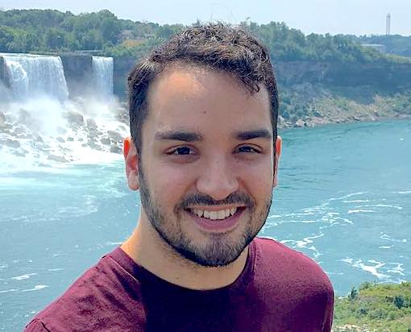

In 2014 I obtained a BSc. in Economics from Universidade Presbiteriana Mackenzie, Brazil and am currently an MSc. in Applied Computing student at the University of Toronto.

My research interests include Data Science, Machine Learning, Natural Language Processing and Economics.  I intend to reconcile the relationship between Economics and Computer Science as complementary disciplines.

My [experience](experience.md) in industry (2012-2016) involves Finance and Operations Management, where I have developed financial risk and budget models, built a customer service department and its metrics from the ground up and carried out customer behavior experiments for revenue and efficiency.

I suggest taking a look at my [projects](projects.md) page where I discuss these and other projects in detail.

Contact me at <u><i>lacerda (at) cs.toronto.edu
[View my resumé](Rafael Lacerda CV 2017.pdf)